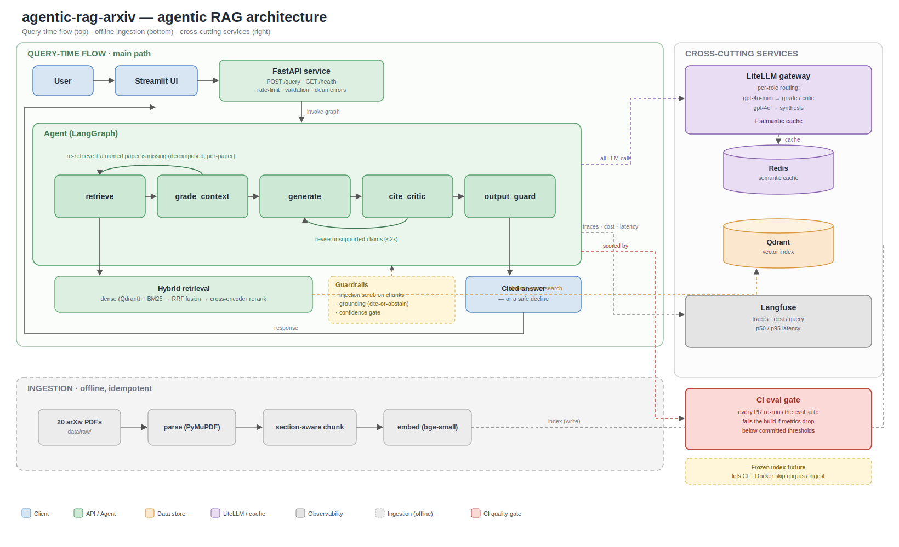

<h1 align="center">agentic-rag-arxiv</h1>

<p align="center">
  <b>Agentic RAG over 20 transformer-lineage papers.</b><br/>
  Ask a research question → get a <b>cited, self-checked</b> answer. Grounded or it
  declines, multi-hop aware, cost-routed, and <b>regression-gated in CI</b>.
</p>

<p align="center">
  <a href="https://github.com/YuliaYur/agentic-rag-arxiv/actions/workflows/eval-gate.yml"></a>
  
  
</p>

<p align="center">
  <video src="https://github.com/YuliaYur/agentic-rag-arxiv/raw/main/docs/demo.mp4" controls muted width="820"></video>
</p>
<p align="center">
  <a href="docs/demo.mp4">Watch the demo</a> · <a href="SOURCES.md">Corpus</a> · <a href="DECISIONS.md">Design log (ADRs)</a>
</p>

---

## Why it's a product, not a demo

- **Cited, or it declines.** Every `[S#]` must map to a real retrieved chunk or the
  answer is rejected — **0 fabricated citations, by construction.** Low confidence → it
  abstains instead of bluffing.
- **Agentic multi-hop.** *"How does ELECTRA differ from BERT?"* needs **both** papers;
  a single embedding leans to one. The agent spots the gap and **re-retrieves per paper** →
  recall on comparisons **0.75 → 1.00**.
- **CI eval gate.** Every PR re-runs the eval and **fails the build if answer quality
  drops** below committed thresholds. *Quality is a versioned build signal, not a vibe.*
- **Cost-routed + cached.** A cheap model grades/critiques, a strong one writes the
  answer; a semantic cache makes repeats free → **−71%** cost routed, **−100%** warm cache.
- **One command.** `docker compose up` brings the whole stack — agent API, Streamlit UI,
  vector DB, cache — with the index **preloaded** (no corpus download, no ingestion).

## Stack

**Agent** LangGraph · **Retrieval** Qdrant (dense + BM25 → RRF → cross-encoder) ·
**LLM** LiteLLM routing + Redis semantic cache · **Serving** FastAPI + Streamlit ·
**Eval/CI** native RAGAS-style metrics + LLM-judge, gated in GitHub Actions ·
**Tracing** Langfuse · Python 3.11.

## Quick start

```bash
git clone https://github.com/YuliaYur/agentic-rag-arxiv && cd agentic-rag-arxiv
cp .env.example .env          # add your OPENAI_API_KEY
docker compose up --build     # UI → http://localhost:8501 · API docs → http://localhost:8000/docs
```

No corpus download or ingestion — the index ships as a committed fixture and loads on
startup. _(Add tracing: `docker compose --profile observability up`. Non-Docker dev: see
the docs below.)_

## Results

_Real numbers — `eval/results/`, `scripts/bench_routing_cache.py`._

**Baseline vs the agent** (6 vetted questions; factual + cross-paper):

| Metric | Baseline | Agent |
|---|---|---|
| Recall@5 | 0.75 | **1.00** |
| Faithfulness | 0.706 | **0.762** |
| Context recall | 0.610 | **0.656** |
| LLM-judge (norm.) | 0.958 | 0.958 |
| Fabricated citations | 0 | **0** *(enforced)* |

Every multi-hop comparison reaches **recall@5 = 1.00** (both papers retrieved) where the
baseline leaves one side out — confirmed on the larger 24-question set (1.000 vs 0.958).

**Cost & latency — before/after the LiteLLM layer:**

| Config | $ / query | p50 latency | Cache hits |
|---|---|---|---|
| Uniform strong model, no cache | $0.0246 | 22.8s | 0% |
| **Routed** (cheap grade/critic + strong synthesis) | **$0.0071 (−71%)** | 24.3s | 0% |
| **Routed + warm cache** | **$0.0000 (−100%)** | 16.7s | 100% |

## Architecture



## Key decisions

The interesting ones — full rationale in [`DECISIONS.md`](DECISIONS.md):

- **CI eval gate** — fail the PR if metrics regress below `eval/thresholds.json`; a frozen
  index fixture lets CI skip the corpus/ingest (ADR-0011).
- **Deterministic multi-hop coverage** — a corpus name-registry forces a per-paper
  re-retrieve when a named paper is missing; the LLM grader alone was too flaky even at
  temperature 0 (ADR-0014).
- **Keep-best agent loop** — re-retrieve on weak context + revise on unsupported claims, but
  a revision can never *worsen* the answer (ADR-0008/0012).
- **Blended rerank** — RRF the cross-encoder back with fusion so it can't bury a
  fusion-strong chunk (ADR-0013).
- **LiteLLM routing + Redis cache** — per-role models, real cost/latency in Langfuse;
  the default model is unchanged so the gate stays stable (ADR-0015).

---

<details>
<summary><b>Full documentation</b> — Docker details, components, CLIs, local dev, layout</summary>

<br/>

### Run with Docker (details)

`docker compose up --build` brings the lean core; Langfuse is opt-in:

```bash
docker compose --profile observability up --build   # + Langfuse at http://localhost:3000
docker compose down                                  # stop (add -v to drop volumes)
```

| Service | Role | Port |
|---|---|---|
| `qdrant` | vector database — the retrieval index | 6333 |
| `redis` | backend for the optional LLM **semantic cache** (`LLM_CACHE_ENABLED=true`) | 6379 |
| `index-init` | one-shot — loads the committed index fixture (`eval/fixtures/index.jsonl.gz`, ~1,150 chunks) into Qdrant, then exits. **Why retrieval works with no ingestion.** | — |
| `api` | the **FastAPI** service wrapping the agent (`POST /query`, `GET /health`) | 8000 |
| `ui` | the **Streamlit** demo (a thin HTTP client of the API) | 8501 |
| `langfuse` + `langfuse-db` | **opt-in** tracing UI + its Postgres (`--profile observability`) | 3000 |

Startup order is enforced via healthchecks + `depends_on`: `qdrant` → `index-init` → `api`
(builds the agent once; first boot downloads ~200 MB of models into a cached volume) → `ui`.
The API reads `OPENAI_API_KEY` from your **`.env` file** (not an ambient shell variable), and
services reach each other by **name** (`qdrant`, `redis`, `langfuse`).

### Local dev (without Docker)

```bash
uv sync                          # or: pip install -e ".[dev,serve,ui]"
pre-commit install               # ruff lint+format on commit
python scripts/fetch_corpus.py   # fetch the 20 PDFs into data/raw/
docker compose up -d qdrant      # vector DB
rag-ingest                       # parse → chunk → embed → index (idempotent)

python scripts/search.py "BLEU score for machine translation" --k 5 --compare
python scripts/agent_ask.py "How does ELECTRA's objective differ from BERT and RoBERTa?"
uvicorn agentic_rag.api.app:app --port 8000   # API   (+ streamlit run ui/streamlit_app.py for the UI)
pytest                           # offline unit tests
```

### Pipeline

```
data/raw/*.pdf → parse (PyMuPDF) → chunk (section-aware) → embed (bge-small-en-v1.5) → Qdrant
```

### Agentic answer graph

A LangGraph state machine with two capped loops the single-shot baseline lacks —
**re-retrieve** when context is weak, and **revise** when claims aren't supported:

```
START → retrieve → grade_context ─(ok | cap)→ generate → cite_critic ─(ok | cap)→ output_guard → END
              ↑           └─(weak / missing paper)┘            ↑          └─(unsupported, revise)┘
```

`grade_context` loops to `retrieve` (≤3 rounds); `cite_critic` loops to `generate`
(≤2 revisions). **Keep-best** means a revision can only improve the final answer. Each node
appends structured metadata to a `trace` (what the UI's "how the agent got here" panel shows).
Rationale: [`DECISIONS.md`](DECISIONS.md) (ADR-0008, ADR-0012, ADR-0014).

```python
from agentic_rag.agent import build_agent, run_agent
final = run_agent(build_agent(), "How does ELECTRA's objective differ from BERT and RoBERTa?")
print(final["guardrail"]["final_answer"])   # the answer, or a safe decline
```

### Retrieval

Hybrid: dense vector search (bge in Qdrant) + in-memory BM25, fused with **Reciprocal Rank
Fusion**, reranked by a local cross-encoder — *blended* so the reranker can't bury a
fusion-strong chunk (ADR-0013). CLI: `python scripts/search.py "<query>" [--k 8] [--no-rerank] [--compare]`.

### Guardrails

Two configurable layers (ADR-0009): **input** — prompt-injection neutralization that redacts
instruction-like spans in retrieved chunks (indirect injection, OWASP LLM01); **output** — an
`output_guard` that enforces structure → cite-or-abstain → grounded → confidence ≥ threshold,
declining with a safe message below the bar.

### LLM routing & caching

All calls go through **LiteLLM** (`agentic_rag.llm`, ADR-0015): **per-role routing** (cheap
`gpt-4o-mini` for grade/critic, strong model for synthesis — opt-in; default is mini
everywhere so the gate stays stable), an **opt-in Redis semantic cache** (`LLM_CACHE_ENABLED=true`),
and **per-call cost/latency** metered onto the Langfuse generation. Benchmark:
`python scripts/bench_routing_cache.py`.

### Observability (Langfuse)

Self-hosted [Langfuse](https://langfuse.com), **off by default**, fail-safe (ADR-0010).
Enable with `LANGFUSE_TRACING=true` (or `--trace`); a run is a tree
`agent-run → node spans → LLM generations` with token counts, cost, and cache-hit flags.

### Evaluation & the CI gate

A golden set + native metric suite (retrieval recall/MRR, RAGAS-style faithfulness / answer
relevancy / context precision+recall implemented natively — *not* the `ragas` package, which
conflicts with langchain-core 1.x — plus an LLM-judge), comparing baseline vs agent
([`eval/README.md`](eval/README.md), ADR-0011).

```bash
python scripts/eval_run.py --status seed     # baseline vs agent on the curated set
```

**The CI gate** ([`.github/workflows/eval-gate.yml`](.github/workflows/eval-gate.yml)) re-runs
the eval on every PR and **fails the build if the agent regresses below the committed floors**
in [`eval/thresholds.json`](eval/thresholds.json) — bounded to a small subset + a frozen index
fixture so it's fast and cheap. *Why it matters:* LLM quality drifts silently on any
prompt/model/retrieval change with no exception thrown; the gate makes quality an enforced,
versioned contract — the line between an LLM **demo** and an LLM **product**.

### Serving (FastAPI + Streamlit)

`POST /query` → a structured `QueryResponse` (`action`, `answer`, `confidence`, `grounded`,
`citations[]`, `steps[]` = the agent trace, `metering` = cost/latency/cache); `GET /health`.
Rate-limited (slowapi, 429), clean JSON errors (422/502/503, never a stack trace). The agent is
built once at startup and calls are serialized (the embedder/reranker aren't concurrency-safe) —
an honest single-instance posture. The Streamlit UI is a thin HTTP client showing the answer,
sources, and the reasoning panel.

### Tests & quality

```bash
pytest                                   # offline (no network, no model downloads)
ruff check . && ruff format --check .    # lint + format (also via pre-commit)
```

### Layout

```
src/agentic_rag/
  ingest/        parse → chunk → embed → index (CLI: rag-ingest)
  retrieve/      hybrid retrieval (dense + BM25 + RRF + cross-encoder)
  llm/           LiteLLM client — per-role routing, cost/latency metering
  answer/        single-shot RAG baseline (kept for eval comparison)
  agent/         LangGraph agent (state, nodes, routing, graph, corpus registry)
  guardrails/    injection neutralization (input) + abstain/confidence gate (output)
  observability/ optional Langfuse tracing (NoOp when disabled)
  eval/          eval harness + the CI gate logic + the index fixture loader
  api/           FastAPI service (schemas, service, app)
scripts/         search · ask · agent_ask · eval_run · eval_gate · bench_routing_cache · export/load_index_fixture
ui/              streamlit_app.py
eval/            golden_set.jsonl · thresholds.json · fixtures/ · results/   (committed)
.github/workflows/ eval-gate.yml          docker-compose.yml · Dockerfile
DECISIONS.md     architecture decision log (ADRs)
```

</details>
